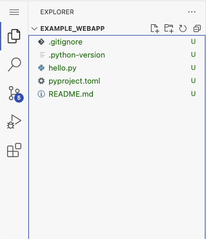
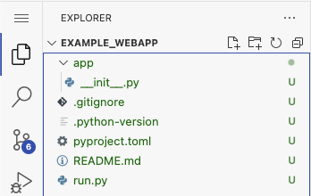
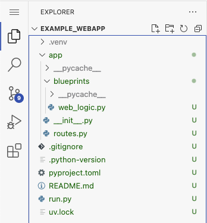
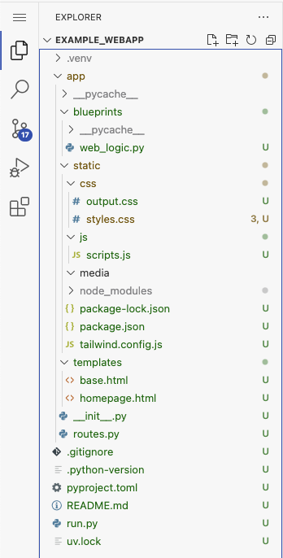

# Web Development Workshop
We'll start with a small presentation that goes into the history of web development to understand why we do the things we do today, as well as to get a quick overview of what's possible nowadays, and then we'll go into a hands-on full stack web development session using Flask (our backend), SQLAlchemy (our ORM/database connection), NPM (our frontend library manager) and Jinja (our frontend templating solution).

## Part 1 - Getting Setup
You'll need to install Docker Desktop locally to follow along with this workshop, and future workshops as well. The reasoning behind this is because this gives us all a single place to start from so there aren't any weird hardware/operating system level issues that will stop you from learning. You can download Docker Desktop from [here](https://www.docker.com/products/docker-desktop/), you may have to logout or restart your computer!

After getting Docker installed, run the following command in your terminal/command prompt:
```
docker run -e SUDO_PASSWORD=password -p 8443:8443 lscr.io/linuxserver/code-server:latest
```

Then open http://localhost:8443 in your browser and you should see a VS Code instance.

If you're up to this point, open the terminal in that VS Code instance via the Hamburger menu (three stacked lines in the top right hand corner) and run the following command:
```
curl -LsSf https://astral.sh/uv/install.sh | sh && exit
```

This will install UV, a project that handles dependencies and virtual environments for Python projects.

Now open the terminal again and run the following command:
```
curl -sSL https://gist.githubusercontent.com/callowaysutton/d671e2b05263702155d69af6c27ea26b/raw/f39033bcb8c029d29e1f11c0ced74254978c12e6/install_node.sh | bash
```

This will install Node and NPM which we will use for managing any frontend JavaScript libraries.

Now once you open your terminal again you'll be ready for some Python full stack web development! Keep in mind that this VS Code environment is ephemeral and after you stop the Docker image you will lose all of the files here, you can always right click the file management plane to download the entire workspace, which I'd heavily recommend!

## Part 2 - Getting Started
Open a new terminal like we did previosly and run the command:
```
uv init example_webapp
```
This will start a new Python project in a folder named "example_webapp"

If you open the command pallette on the VS Code instance, either with `CMD+Shift+P` on MacOS or `Ctrl+Shift+P` on Windows, start typing in `Open Folder`, then go to `workspace/example_webapp` and press `Ok`. You should now see something similar to this:



We're going to organize this project for web development purposes so the first thing we're going to do is simply rename that `hello.py` to `run.py` which will act as our main entrypoint for development.

We're then going to create a new folder called `app` which will contain all of our business logic and application code. This folder is what's called a `Package Folder` and if you want more details into why we're doing the next few steps you can read about all of that [here](https://docs.python.org/3/tutorial/modules.html#packages)

In this folder, we're then going to create an `__init__.py` which will act as our entrypoint for our web application. So far, if you've been following along, your directory structure should now look like this:



## Part 3 - Setting Up Flask
Now we have everything ready to get started with actually building a full stack web app. First we want to install Flask into our virtual environment, which we can simply do with `uv add flask`. After that, we just have to modify `app/__init__.py` to contain the following:
```py
from flask import Flask

webapp = Flask(__name__)
```

and modify `run.py` to have
```py
from app import webapp

if __name__ == "__main__":
    webapp.run(debug=True)
```

and if everything is correct, when we do `uv run run.py` we should see:
```
abc@f102c647e122:~/workspace/example_webapp$ uv run run.py 
warning: `VIRTUAL_ENV=/lsiopy` does not match the project environment path `.venv` and will be ignored
 * Serving Flask app 'app'
 * Debug mode: on
WARNING: This is a development server. Do not use it in a production deployment. Use a production WSGI server instead.
 * Running on http://127.0.0.1:5000
Press CTRL+C to quit
 * Restarting with stat
 * Debugger is active!
```
<small> If you Ctrl+Click/Cmd+Click on the `http://127.0.0.1:5000` it will open a new tab where your web app is running </small>

As you can probably see though, there aren't any routes, so this is a pretty stupid web server.

### Adding Routes
It's important to keep everything organized in a full stack application! This will guide you through the best practices for organizing your routes and business logic so you don't have a single Python file with thousands to tens of thousands lines of code...

The first thing you want to do is make a new directory in the `app/` folder called `blueprints`. This will be the place where all of your business logic takes place. We're going to make a file called `web_logic.py` which will handle all of our basic web pages (ie, home, about, contact, etc type pages); so the total path should be `app/blueprints/web_logic.py`.

Then we'll add a simple route to this file like this:
```py
from flask import Blueprint

web_logic = Blueprint("web_logic", __name__)

@web_logic.route("/")
def home():
    return "Hello World!"
```

Then you'll want to make a new Python file in the `app/` folder called `routes.py` which will be the place where you consolidate all of your routes. This is mainly not to clutter up your `__init__.py` file which is meant to contain all of your initialization/setup code.

In this `routes.py` file, we'll glue together that blueprint we just made with our main web app instance like so:
```py
from app import webapp

from app.blueprints.web_logic import web_logic

webapp.register_blueprint(web_logic)
```

Finally, modify your `__init__.py` so that it has the following line at the bottom of the document:
```py
from app import routes
```

Your directory structure should now look something like this:




And that's it! Now we have our index route actually doing something instead of presenting an error.

### Using Templates
We can use Jinja templates by simply just adding a `templates` folder into the `app/` directory. After that, we can just make some HTML files like `base.html` and `homepage.html`.

In the `base.html` we can use the following template:
```jinja
<!DOCTYPE html>
<html lang="en">
<head>
    <meta charset="UTF-8">
    <meta name="viewport" content="width=device-width, initial-scale=1.0">
    <title>Document</title>
</head>
<body>
    
</body>
</html>
```

And for the `homepage.html` we can use this template:
```jinja



<main>
    <h1>Hello World</h1>
</main>

```

Finally, update our index route to look like this:
```py
from flask import Blueprint, stream_template

web_logic = Blueprint("web_logic", __name__)

@web_logic.route("/")
def home():
    return stream_template("homepage.html")
```
<small>We're streaming the template because it has better performance characteristics for frontend apps, it'll take advantage of things like TCP Slow Start and let clients like Chrome load multiple assets at the same time as the main content streams in.</small>

Cool, so we can do simple templating; now let's start using NPM so we can use some cool frontend libraries.

### Setting up Static Assets and NPM
Add another directory called `static` to the `app/` directory. This will contain our static assets like NPM packages, our own JavaScript scripts, CSS, images, and any other media we don't expect to change.

Let's go ahead and make some other directories within this `static/` directory, like `js`, `css`, and `media`. Let's also go ahead and make a `styles.css` and `scripts.js` in the `css` and `js` folders respectively.

In our `base.html` let's include those files in the \<head> section, these will act as our global styles and scripts.
```html
<link href="/proxy/5000/{{ url_for('static', filename='css/styles.css') }}" rel="stylesheet">
<script src="/proxy/5000/{{ url_for('static', filename='js/scripts.js') }}" defer></script>
```

<small>The `defer` in the `script` tag will defer running this script until the entire body has loaded.</small>

Okay cool, so now we can add our own styles and scripts pretty easily. Next, we'll just install Tailwind as an example. do `cd app/static` in the terminal and then do:
```sh
npm install -D tailwindcss
npx tailwindcss init
```

This will make our `npm_modules` folder which is where any packages we install would be located. Next we'll add the following to the `tailwind.config.js` file which was created:
```js
/** @type {import('tailwindcss').Config} */
module.exports = {
  content: ["../templates/**/*.html", "./js/**/*.js"],
  theme: {
    extend: {},
  },
  plugins: [],
}
```

and add the following to our `static/css/styles.css`:
```css
@tailwind base;
@tailwind components;
@tailwind utilities;
```

and run the following command from your `app/static` folder to get your `static/css/output.css` which will be what we use for importing Tailwind into our HTML:
```sh
npx tailwindcss -i ./css/styles.css -o ./css/output.css
```

and finally import that `output.css` into your HTML like so:
```jinja
<link href="/proxy/5000/{{ url_for('static', filename='css/output.css') }}" rel="stylesheet">
```

Okay now we're finally done with all of that and we can use Tailwind within our application!

If you're thinking "Wow, that was a lot of work to just import a single library" you'd be correct in your thinking. In the past you would simply download a full fat library and have a universal HTML, CSS and JS parser run over your code to emit minified versions of all of your code. But recently, a lot of JavaScript developers thought they would graciously do this all for you in each of their own ways; don't support these kinds of developments in the future :)

Don't forget to add the following to your .gitignore!
```
# NPM generated files
node_modules/
```

Your project structure should now look similar to this:



### Setting up Database Models
The final, and most likely most important, thing to add to any full stack web application is a database. We're actually going to use an ORM which adds an abstraction layer over Python classes and let's us use any database management engine via a simple connection string.

We'll start by adding SQLAlchemy to our project via 
```sh
uv add flask-sqlalchemy
```

Then we'll make our database connection by updating our `__init__.py` to the following:
```py
from flask import Flask
from flask_sqlalchemy import SQLAlchemy

db = SQLAlchemy()
webapp = Flask(__name__)

webapp.config["SQLALCHEMY_DATABASE_URI"] = "sqlite:///project.db"
db.init_app(webapp)

from app import routes
```

We'll then make a new file called `models.py` in the `app/` directory which will contain all of our database object models. Let's make a simple model which tracks the amount of requests made to the application:
```py
from datetime import datetime
from app import db

class Requests(db.Model):
    id = db.Column(db.Integer, primary_key=True)
    date = db.Column(db.String, default=lambda: datetime.utcnow().isoformat())
    count = db.Column(db.Integer, default=1)
```

As a quick database refresher, you always need a unique ID for each row and we want to use simple types like Strings and Integers so that our database is easily "cross platform" from one database to the next. We could use a Datetime object directly in SQLite but we may run into issues with other applications, in other languages, not knowing what a Datetime object is!

Now let's make sure our table was added to our database by making a new management script that drops all old data and inserts all of the models defined:
```py
from app import webapp, db

with webapp.app_context():
    db.drop_all()
    db.create_all()
```

Let's now add a new route in a new blueprint to check this and call it `server_logic.py`:
```py
from app import db, webapp
from app.models import Requests

from flask import Blueprint, jsonify

server_logic = Blueprint('server_logic', __name__)

@webapp.before_request
def track_requests():
    most_recent_request = Requests.query.order_by(Requests.id.desc()).first()
    print(most_recent_request)
    if most_recent_request is None:
        new_request = Requests(count=1)
    else:
        new_request = Requests(count=most_recent_request.count+1)
    db.session.add(new_request)
    db.session.commit()

@server_logic.route('/timeline')
def get_timeline():
    all_requests = Requests.query.order_by(Requests.id.desc()).all()
    timeline = [
        {
            'id': request.id,
            'date': request.date,
            'count': request.count
        } for request in all_requests
    ]
    return jsonify(timeline)
```

## Part 4 - Let's Create Something!
Now that we know how to make a full stack application from scratch, let's all brainstorm on ideas to make using this simple framework we've created!

As an aside, this may just seem like something that's very niche towards Python; but the ideas presented here are used everywhere in other languages and frameworks. For example, the Gin framework in Golang and NTex in Rust are both very similar conceptually and frameworks like Ruby on Rails, Laravel for PHP, and Springboot have similar cocepts to ORMs.

This framework will also let you quickly spin up any ideas you have very quickly since it's very easy to conceptually know what's happening